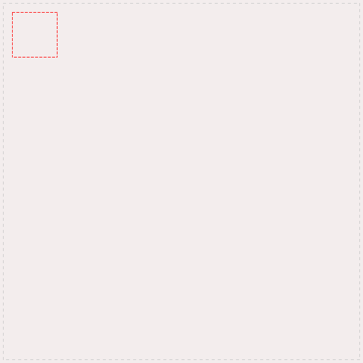
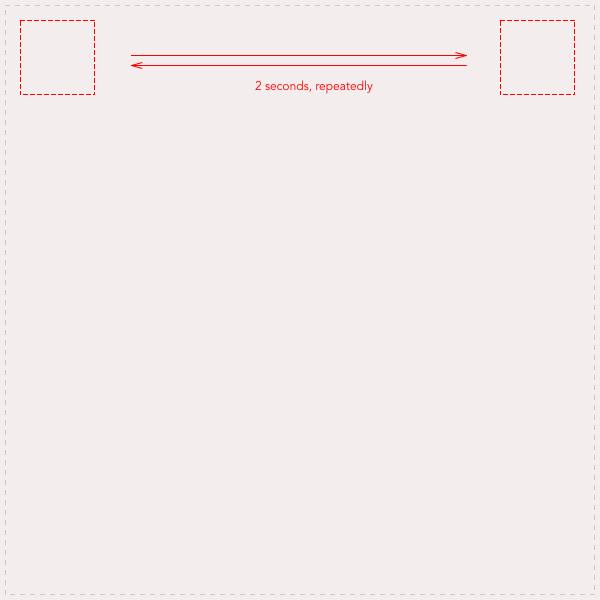

## Date 
25th May 2018, from 9h30 to 16h30;

## About this Project
This project has been organised as a challenge for the end of the  first period of our web dev training called `La Prairie`.

**Objectives**
Make an animation using CSS.

## Layout

## Final work
[It looks like this](https://marianeniwe.github.io/CSS-Animation/.)

